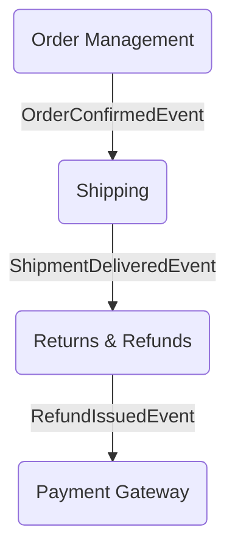

The concept of a **Context Map** in Domain-Driven Design (DDD) serves as a blueprint for understanding the relationships and interactions between different **Bounded Contexts** within a system. It explains various relationship patterns such as Shared Kernel, Customer/Supplier, and Anticorruption Layer, and illustrates how these patterns can be applied in a sales order processing example.

---

### 🗺️ What Is a Context Map?

A **Context Map** is essentially:

> A **top-level blueprint** showing all the **Bounded Contexts**, their **interactions**, and the **relationship patterns** governing those interactions.

It describes *how* different parts of the system exchange information and *what kind of dependencies* or integration styles exist between them.

Think of it like a domain-aware architectural map.

---

### 🔌 Relationship Styles in a Context Map

In addition to listing Bounded Contexts, a Context Map shows **integration styles**, such as:

| Relationship Pattern     | Description                                                                 |
|--------------------------|-----------------------------------------------------------------------------|
| **Shared Kernel**        | Two contexts share a common subset of the model and evolve it together.    |
| **Customer/Supplier**    | One context depends on another's model; usually with defined expectations. |
| **Conformist**           | A context conforms to the upstream model with little influence.             |
| **Anticorruption Layer** | Translates between models to prevent corruption of the local domain.        |
| **Published Language**   | Contexts agree to communicate via a well-documented format (e.g. events).   |
| **Open Host Service**    | Exposes an API or contract that others use safely.                          |

These styles help resolve *real-world team and design frictions* in a collaborative ecosystem.

---

### 🛍️ Applying It to Sales Order Processing

Let’s map out the Bounded Contexts from our ongoing example:

```
             +----------------------+
             |   Order Management   |◄---+
             +----------------------+    |
                      ▲                 |
                      | Published       |
                      | Language        | OrderConfirmedEvent
                      |                 |
             +----------------------+   ▼
             |    Shipping Context   |◄-+
             +----------------------+

             +----------------------+
             | Inventory Management |
             +----------------------+

             +----------------------+
             |   Payment Gateway    |
             +----------------------+

             +----------------------+
             |   Tax Calculation    |
             +----------------------+
```

#### 🔍 Example Relationship Highlights:

- **Order Management → Shipping**:  
  `Published Language` pattern—Order confirms, emits an event, Shipping reacts.

- **Order Management → Payment Gateway**:  
  Likely uses an **Open Host Service** or conforms to external payment protocols.

- **Shipping ↔ Inventory**:  
  Could use an **Anticorruption Layer** to translate inventory statuses meaningfully.

- **Inventory → Order Management**:  
  Might use **Domain Events** to signal stock changes impacting orders.

---

### 🎯 Why Is This Helpful?

- **Team Clarity**: Each team owns one context, knows what to expect from others.
- **Bounded Trust**: Avoids accidental dependency on other teams’ internal models.
- **Strategic Thinking**: You decide where strict boundaries are needed, and where flexibility is okay.
- **Integration Clarity**: Infrastructure teams know where events, APIs, and anti-corruption layers should go.

---

Brilliant! Let's enrich our domain by introducing the **Returns & Refunds** subdomain and then walk through best practices for managing the **Context Map** within a Scrum-based Agile team.

---

### 🔄 Introducing Returns & Refunds as a Subdomain

**Returns & Refunds** deals with post-sales workflows—customers returning items, validations (e.g. damage, timing), and issuing refunds or replacements. Though essential, it’s often a **Supporting Subdomain**, with moderate complexity and direct ties to both **Order Management** and **Inventory**.

#### 💡 Domain Concepts

| Concept                | Role                                                                        |
|------------------------|-----------------------------------------------------------------------------|
| `ReturnRequest`        | Aggregate that initiates a return process                                   |
| `RefundPolicy`         | Value object enforcing business rules (e.g. return window, product condition) |
| `RefundTransaction`    | Entity representing the financial part of a refund                          |
| `ReturnReason`         | Value object categorizing why the item was returned                         |
| `ReturnAuthorizedEvent`| Domain event indicating a validated return request                          |

#### 📦 Context Map Expansion

```
  +----------------------+
  |   Order Management   |
  +----------------------+
         |
         | Published Language: OrderConfirmedEvent
         ▼
  +----------------------+
  |    Shipping Context   |
  +----------------------+
         |
         | Published Language: ShipmentDeliveredEvent
         ▼
  +---------------------------+
  |  Returns & Refunds Context |
  +---------------------------+
         |
         | Open Host Service or Event
         ▼
  +----------------------+
  |   Payment Gateway     |
  +----------------------+
```

- `Returns & Refunds` listens for `ShipmentDeliveredEvent` to start eligibility checks.
- It exposes an Open Host Service or emits `ReturnAuthorizedEvent` → triggers refund in `Payment Gateway`.

---

### 🗂️ How to Effectively Create & Maintain a Context Map in Scrum Teams

#### ✅ 1. **Make It Collaborative**
- Create the map during **initial domain discovery** and **Sprint 0** or **Epic kickoff**.
- Use **Event Storming** or **DDD workshops** with domain experts, architects, and developers.
- Map bounded contexts using tools like Miro, Lucidchart, or whiteboards.

#### 🧩 2. **Use Visual Tools**
- Recommended formats:
  - **Context Map diagrams** showing contexts, boundaries, integration types.
  - **Tables or markdown docs** documenting events and APIs exchanged.

#### 📌 3. **Version It in Your Repo**
- Store the map in your **documentation repo** or alongside source code (e.g. `/docs/context-map.md`).
- Treat it like code: use Git versioning, pull requests, and reviews.

#### 🔄 4. **Keep It Updated During Scrum**

| Scrum Artifact        | Role in Context Map Maintenance                                   |
|-----------------------|-------------------------------------------------------------------|
| **Sprint Planning**   | Revisit if new contexts or integrations are being introduced.     |
| **Backlog Refinement**| Ensure domain events and context relationships are documented.    |
| **Definition of Done**| Include “Context Map updated” for strategic stories.              |
| **Retrospectives**    | Use feedback to refine domain relationships and terminology.      |

---

### 🧠 Tip: Use it as a Living Aid

> The Context Map should *not* be a static diagram tucked away.  
> Use it in stand-ups, architecture reviews, onboarding, even test planning.

Scrum teams thrive when domain complexity becomes *visible*—this map is your shared memory, your contract, and your source of truth for systemic design.

---

Let’s look at some excellent tools for creating and maintaining **Context Maps** in Domain-Driven Design, and then I’ll share a practical template you can adapt for your own system.

---

### 🛠️ Tools for Creating Context Maps

Here are some popular and effective options:

| Tool                  | Highlights                                                                 |
|-----------------------|----------------------------------------------------------------------------|
| **Context Mapper**    | Open-source DSL for strategic DDD. Supports modeling, refactoring, and code generation. Available as [VS Code extension](https://contextmapper.org/) and [Eclipse plugin](https://contextmapper.org/). |
| **Miro**              | Great for collaborative whiteboarding. Use the [starter kit from ddd-crew](https://github.com/ddd-crew/context-mapping) to drag-and-drop DDD patterns and relationships. |
| **Lucidchart / Draw.io** | Visual diagramming tools. Ideal for quick sketches and sharing with non-technical stakeholders. |
| **PlantUML**          | Text-based diagram generation. Can be integrated with Context Mapper to auto-generate visuals. |
| **Qlerify**           | Offers DDD modeling support with glossary and visual tools for context mapping. |

For teams using Git, **Context Mapper** is especially powerful—it lets you version your context maps as code and generate diagrams automatically.

---

### 📄 Context Map Template (Markdown-Based)

Here’s a simple markdown template you can use in your repo (`/docs/context-map.md`):

```markdown
# 📌 Context Map: Sales Order Processing System

## 🧱 Bounded Contexts

- **Order Management** (Core)
- **Shipping & Logistics** (Supporting)
- **Inventory Management** (Supporting)
- **Returns & Refunds** (Supporting)
- **Payment Gateway** (Generic)
- **Tax Calculation** (Generic)

## 🔗 Relationships

| Source Context       | Target Context        | Relationship Pattern      | Integration Style          |
|----------------------|-----------------------|---------------------------|----------------------------|
| Order Management     | Shipping & Logistics  | Published Language        | Domain Events              |
| Order Management     | Payment Gateway       | Open Host Service         | REST API                   |
| Shipping             | Returns & Refunds     | Customer/Supplier         | Domain Events              |
| Returns & Refunds    | Payment Gateway       | Open Host Service         | REST API                   |
| Inventory            | Order Management      | Anticorruption Layer      | Internal Adapter           |


## 📣 Domain Events

- `OrderConfirmedEvent`
- `ShipmentDeliveredEvent`
- `ReturnAuthorizedEvent`
- `RefundIssuedEvent`

## 🧭 Notes

- Context Map is reviewed during Sprint Planning and updated if new integrations are introduced.
- Stored in Git and versioned alongside architecture documentation.
```

Keeping the **Context Map** side-by-side with subdomain code in a **lightweight folder structure** gives teams visibility, traceability, and frictionless updates. Let’s sketch out how to set this up effectively.

---

### 🗂️ Suggested Project Structure

Here’s a folder structure that aligns subdomain code with documentation in a tidy way:

```plaintext
src/
│
├── order-management/
│   ├── domain/
│   ├── application/
│   ├── infrastructure/
│   ├── README.md                 <-- Overview of the subdomain
│
├── shipping/
│   ├── domain/
│   ├── application/
│   ├── infrastructure/
│   ├── README.md
│
├── returns-refunds/
│   ├── domain/
│   ├── application/
│   ├── infrastructure/
│   ├── README.md
│
docs/
│
├── context-map.md               <-- System-level map of all contexts
├── events-catalog.md           <-- Optional: catalog of domain events
└── glossary.md                 <-- Optional: ubiquitous language terms
```

Each subdomain lives in its own **bounded context folder** with its own `README.md`. This local readme describes internal modeling, key aggregates, and local events. The central `context-map.md` ties everything together across the ecosystem.

---

### ✨ Benefits in Cloud Git Hosting

Whether using GitHub, Bitbucket, or Azure DevOps:

| Advantage                         | How It Shows Up                                                           |
|-----------------------------------|----------------------------------------------------------------------------|
| **Markdown rendering**            | Gorgeous previews, anchors, tables, and diagrams for easy team access.   |
| **File-based versioning**         | Every update to context or events is tracked—just like code.             |
| **Pull Request reviews**          | Docs live with code, so updates can be discussed and approved seamlessly.|
| **Integration with Issues & Boards** | Docs link directly from work items or epics.                              |

---

### 🧭 Template: `context-map.md`

Here’s a practical starting point:

```markdown
# 🗺️ Context Map: Sales Domain

## 📦 Bounded Contexts

| Context            | Type         | Ownership / Repo Path        |
|--------------------|--------------|-------------------------------|
| Order Management   | Core         | `/src/order-management/`     |
| Shipping           | Supporting   | `/src/shipping/`             |
| Returns & Refunds  | Supporting   | `/src/returns-refunds/`      |
| Payment Gateway    | Generic      | External                     |

## 🔗 Relationships

| Source            | Target             | Pattern           | Integration      |
|-------------------|--------------------|-------------------|------------------|
| Order Management  | Shipping           | Published Language| Domain Events    |
| Shipping          | Returns & Refunds  | Customer/Supplier | Domain Events    |
| Returns & Refunds | Payment Gateway    | Open Host Service | REST API         |

## 📣 Domain Events

- `OrderConfirmedEvent`
- `ShipmentDeliveredEvent`
- `ReturnAuthorizedEvent`
- `RefundIssuedEvent`
```

You can add diagrams using tools like [Mermaid](https://mermaid-js.github.io) (rendered natively on GitHub), like this:



---

### 🔄 Updating Seamlessly in Scrum

To keep it lightweight:

- Add **“Context Map Updated”** to your Definition of Done checklist.
- Encourage teams to update local `README.md` as part of feature commits.
- Use automation if needed: e.g. script extracts event names and updates `events-catalog.md`.
- Assign ownership: every Epic can have a designated Context Steward responsible for updates.

---

Here's a lightweight starter layout you can use as a foundation for your DDD-aligned project. It’s perfect for GitHub or Bitbucket, with clean Markdown support and subdomain-aware code organization.

---

### 🗂️ Folder Structure

```
sales-system/
│
├── src/
│   ├── order-management/
│   │   ├── domain/
│   │   ├── application/
│   │   ├── infrastructure/
│   │   └── README.md
│   │
│   ├── shipping/
│   │   ├── domain/
│   │   ├── application/
│   │   ├── infrastructure/
│   │   └── README.md
│   │
│   ├── returns-refunds/
│   │   ├── domain/
│   │   ├── application/
│   │   ├── infrastructure/
│   │   └── README.md
│
├── docs/
│   ├── context-map.md
│   ├── events-catalog.md
│   └── glossary.md
│
└── README.md
```

---

### 📝 Sample Content for `context-map.md`

```markdown
# 🗺️ Context Map: Sales Domain System

## 📦 Bounded Contexts

| Context            | Type         | Path                    |
|--------------------|--------------|-------------------------|
| Order Management   | Core         | `/src/order-management` |
| Shipping           | Supporting   | `/src/shipping`         |
| Returns & Refunds  | Supporting   | `/src/returns-refunds`  |

## 🔗 Relationships

| Source            | Target             | Pattern           | Integration      |
|-------------------|--------------------|-------------------|------------------|
| Order Management  | Shipping           | Published Language| Domain Events    |
| Shipping          | Returns & Refunds  | Customer/Supplier | Domain Events    |

## 📣 Domain Events

- `OrderConfirmedEvent`
- `ShipmentDeliveredEvent`
- `ReturnAuthorizedEvent`

## 📌 Notes

- Context Map is reviewed every sprint during Planning and Refinement.
- Each context has its own README with aggregates, events, and glossary.
```

---

### 🔧 Tips for Keeping It Seamless

- Use Git hooks or CI checks to ensure markdown files are validated during PRs.
- Embed diagrams using [Mermaid](https://mermaid.js.org/) directly in markdown for visual context maps.
- Link local README.md from each subdomain to `/docs/context-map.md` for traceability.
- Assign a “Context Steward” for each Scrum team to keep things aligned and up-to-date.

---
